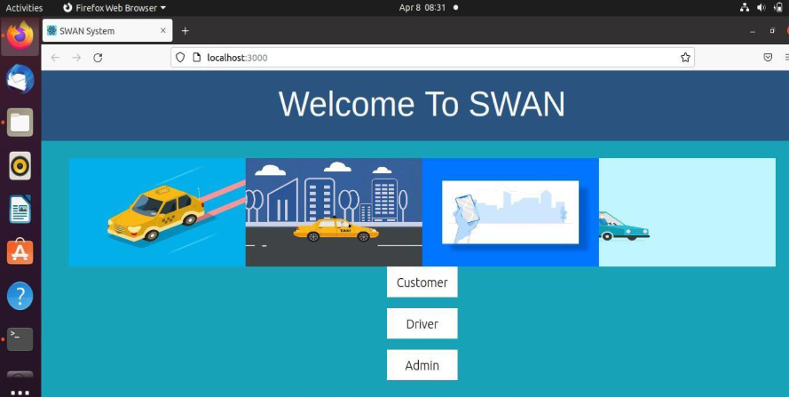

## Taxi Management System - SWAN

<hr>

#### Problem Statement:
For various purposes people need to travel on the daily basis. And there are various mediums used for travelling. But getting the transportation medium at peoples convenience is a difficult thing to achieve. So, our problem statement is to build a web application for Taxi Management System which provide the easy platform for taxi booking.
<hr>

#### Objectives:
1. To create a location based reactive system where customers can book taxis that are in the proximity to their location and can plan a trip to new location.
2. To save time of both the customers and drivers during transit.
3. To provide excellent customer service, with instant response and easy payment gateway.

<hr>

#### Tech Stack Used:

```
Programming Languages:
1. HTML 
2. CSS
3. JavaScript
4. SQL

Frameworks:
1. React
2. Express
3. NodeJS
4. MySQL

```
<hr>

<p align="center">
<a href=" ">
    
</a>
</p>
